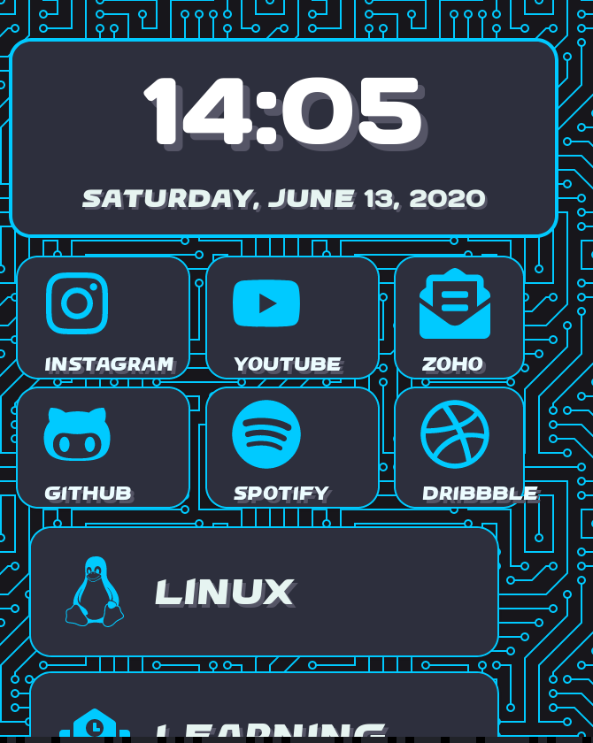
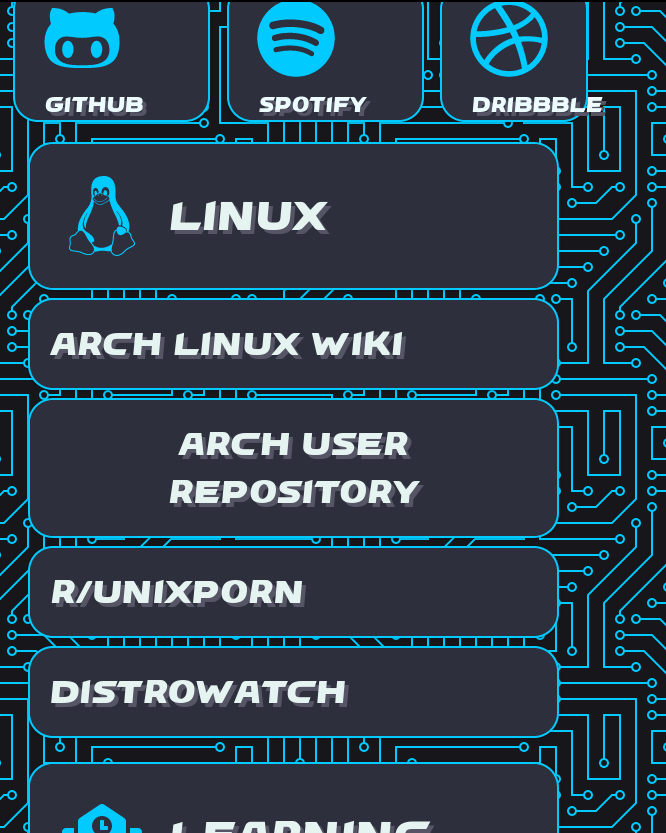

## Introduction

> What is a Startpage?

The source code contained within this repository is intended to be used as a locally hosted replacement for your browser's
new tab page, with your personalized modifications to its source code. However, I maintain the thing and have pretty good
internet, so I just use the [live demo version](https://thomashighbaugh.github.io/startpage/) as my personal startpage.

> Why Would You Use A Startpage Instead of the Default?

Because I find the clickbait on Firefox's New Tab Page to be unbearable and distracting when I am working and see something
else to ruin my faith in humanity. Truth be told, I often am already halfway through typing out the site I want to go to
by the time the tab is fully open, but the links are conventional and I like bootstrap's sleekness, so they are included
(and kept out of the way)

While you can edit what appears in `about:config`, updates (which because I use a rolling Linux distro are somewhat often)
'magically' reset these settings (in my experience at least) which is not the case with setting the New Tab page to being
my own site.

> Why Not Use A Browser Extensions With All of Its Cool Options

As I have often heard relatives quip over the years, `if you want it done right, do it yourself`. A lot of high quality
extensions do exist for Firefox and other browsers that would perform essentially this function and I have used some,
experimented with their source code even, but ultimately I would rather take it upon myself to code in the desired functions
and exclude the undesired ones. I never really shift between day and night mode, for me its always night mode on all
my screens, nor do I personally see much utility in shifting between screen layouts on the fly since **I have never needed
to do this**. I may write an extension in the future but for now, that all seems extraneous.

## Features

- Dropdown Lists of Links, Arranged by Category - using Bootstrap

- Font Awesome Icons that change color when hovered over - using inline SVG editing

- Tiled SVG Background Image - using Hero Images

- Smooth font (Arms find it [here](https://www.1001freefonts.com/arms-font.font))

- Dark Interface - perfect for low light environments

- Responsive - Designed to insure touchscreen and small screen support. Finally! A startpage useful on mobile too

- Prettier formatted code - ease of maintaince and modification

- Locally supplied copies of all external libaries - enables offline development and prevents unnecessary requests to outside servers

## Gallery

